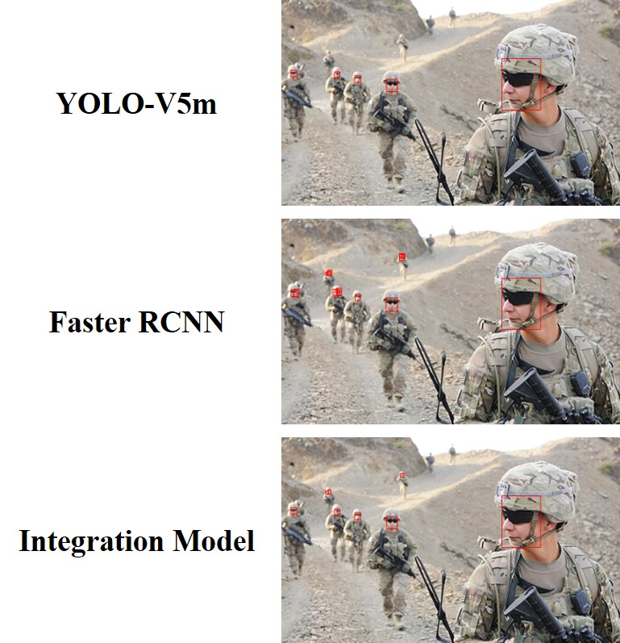

# WiderFaceDetection_Experiment
Integration Result of MMDetection_pkl and YOLOV5_txt on WIDERFACE Datasets

## 1 Dataset Preparation

### 1.1 Data DownLoad
Data DownLoad from [WIDERFACE Dataset](http://shuoyang1213.me/WIDERFACE/index.html)

Unzip the downloaded file and place it in the corresponding folder.

Empty file `Datasets` is in `Datasets.zip`, it is crucial, unzip it then do the following.

1. WIDER Face Training Images    ->   `./Datasets/WIDER_train/`
2. WIDER Face Validation Images  ->   `./Datasets/WIDER_val/`
3. Face annotations              ->   `./Datasets/wider_face_split/`

### 1.2 DataFormat Transform
Thanks to [Data Transformation Guide from CSDN](https://blog.csdn.net/mary_0830/article/details/116589279)

Run the following program step by step:

1. `face2voc.py`: Convert the original format to VOC format.
2. `voc2coco`: Convert VOC format to COCO format.     # Used in [MMDetection](https://github.com/open-mmlab/mmdetection) tools
3. `yolo_extract.py`: Extract filenames.
4. `xml2yolo.py`: Convert COCO format to YOLO format. # Used in [YOLOV5](https://github.com/ultralytics/yolov5) tools

## 2 Train
MMDetection trainning data file in `./Datasets/widerface_COCO`

YOLO-V5 trainning data file in `./Datasets/widerface_YOLO`

Some trainning result in `./mmdetection_RCNN/` and `./YOLOV5_yolov5m`

## 3 Visualization
We provide two visualization ways, one pkl style using `./mmdetection_RCNN/Visualization_pkl.ipynb` and one yolo style using `./YOLOV5_yolov5m/Visualization_YOLOV5.ipynb`

## 4 Evaluation
It is convenient to use MMDetection's tool `mmdetection/tools/analysis_tools/eval_metric.py` for result evaluation uniformly, but it needs to convert yolo's results into pkl files, which is supported in `./YOLOV5_yolov5m/YOLOresult2pkl.ipynb`.

## 5 Model Results Integration
Here we use NMS for model results (mmdetection style `.pkl` and yolo style `.txt`), which is supported in `./NMS_pklAndYolov5.ipynb`.
